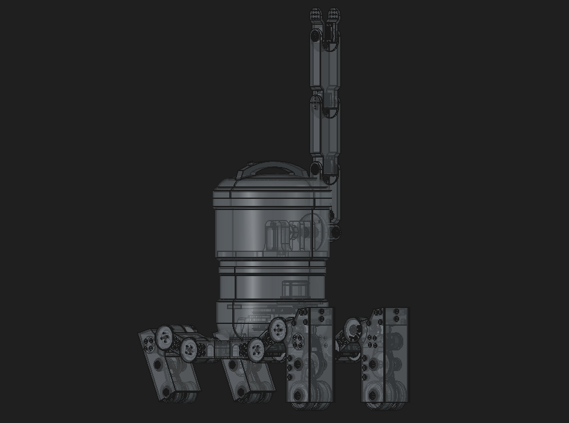

# MIST (WIP)
MIST is a robot in the form of a rice-cooker with legs, originating from the Pantheon Show. Our goal in this project was to test our skills whilst making something beautiful. 



## Replication
All of the instructions on recreating the robot are provided below.

### Software

#### 1. Operating System
We've chosen DietPi due to its stability and in order to maximise available resources by ditching the GUI. It would be preferarble to flash some ssd instead of a flash card for reliability. In installation of the DietPi on the raspberry pi, we must choose to install these programs: tailscale, openssh, go.

#### 2. Remote control with Tailscale (optional but recommended)
```bash
# Authentication
tailscale up

# Port Forwarding
echo 'net.ipv4.ip_forward = 1' | sudo tee -a /etc/sysctl.conf 
echo 'net.ipv6.conf.all.forwarding = 1' | sudo tee -a /etc/sysctl.conf
sudo sysctl -p

# Once you've connected your pi to the network, you can ssh into it from your personal computer with these commands:
ssh username@tailscale-ip
# You can also use device name given or chosen in tailscale:
ssh username@device-name
```

#### 3. Adding GOPATH to $PATH
```bash
# 
nano ~/.bashrc

# Write these into the file:
export GOPATH=$HOME/go
export PATH="$PATH:$GOPATH/bin"
# Exit nano, and save the changes.

# Apply changes
source ~/.bashrc
```

#### 4. Installing text to voice (espeak)
```bash
# Configure audio drivers:
dietpi-config
# > Select '2: Audio Options'
# > For the 'Sound card', select 'rpi-bcm2835-hdmi' or 'usb-dac' depending on your speaker.

# Install text to speech module:
apt update
sudo apt install espeak-ng -y
```

#### 6. Setting up ollama
```bash
# Install Ollama
sudo apt-get install zstd
curl -fsSL https://ollama.com/install.sh | sh

# Get the model
ollama pull qwen3.5:0.8b
```

#### 7. Setting up mist-os
Note that mist-os isn't an actual operating system, but rather just a program.
```bash
# Install mist-os:
go install https://github.com/flushloll/MIST/mist-os/main.go

# Run mist-os:
mist-os

# Stop:
Ctrl + C
```

Optional: If you wish to start mist-os after boot automatically:
```bash
# Find where matetra-os is installed:
which matetra-client
# > Please remember the path or save it to clipboard

# Open Configuration menu:
dietpi-autostart
# > Select "Custom script (background, no autologin)"
# > Press OK
# DietPi should automatically open an editable text file, otherwise open it:
nano /var/lib/dietpi/dietpi-autostart/custom.sh
# > Paste this into the file:
/root/go/bin/mist-os # paste the path given from `which matetra-client` command.
exit 0
# > Save everything, and exit
```

### Hardware
For the context, MIST is originally modelled in CTC Creo in imperial units.
#### 1. BOM - Bill of Materials
!TODO: Insert BOM from Google Sheets

#### 2. Build Guide
!TODO: Create LEGO-styled build guide? (would be cool but optional)

#### 3. Electronics Wiring Guide
!TODO: Insert wiring guide from Figma

#### 4. Enable I2C & Components Test
```zsh
# Open the configuration menu:
dietpi-config
# > Navigate to 'Advanced Options',
# > Ensure 'I2C state' is selected as 'On',
# > Ensure 'I2C frequency' is set to 100 kHz,
# > Exit and reboot the raspberry pi.

# To see if your IMU module is connected, run:
sudo i2cdetect -y 1
# 0x4b is IMU
# ____ is PCA9685
```

#### 5. Next thing

## Contribute
### Realtime file sync between devices
In order to sync files between devices in real-time:
```bash
rsync -avz /path/to/local/dir/ username@remote_ip:/path/to/remote/dir/
```

### State of Repository
#### mist-os
#### simulations
#### wiring
for William:
- I have finilised the power distribution for the project,
- I vaguely grasped concept for common ground, did I understand it correctly? Could you please check that as well?
for Esia:
- I couldn't get US aliexpress working while Amazon's options and price wasn't good; could you please pick the correct Buck Converters and power distribution boards and batteries?
#### CAD