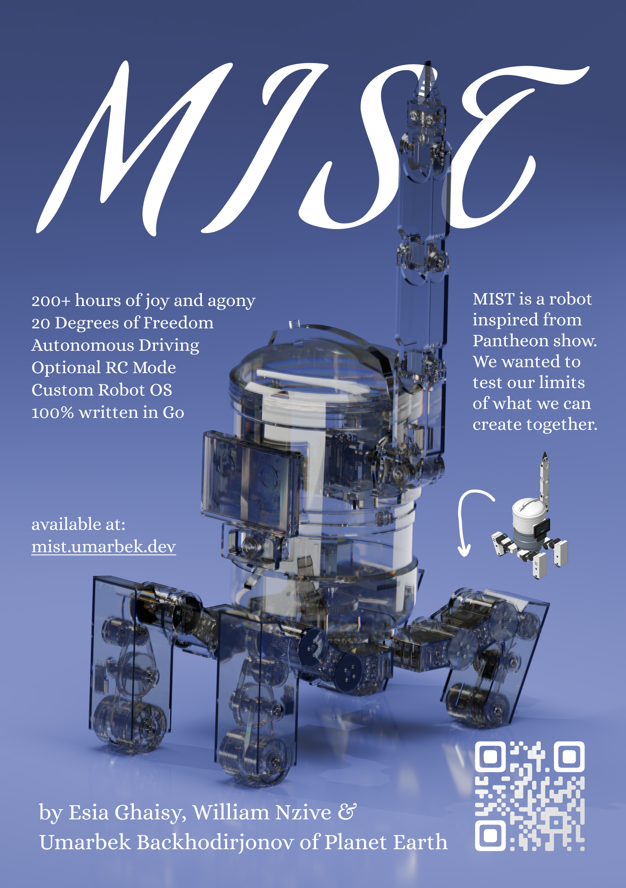
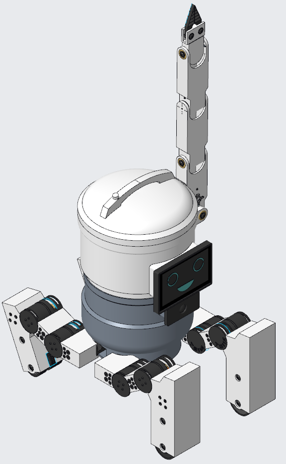
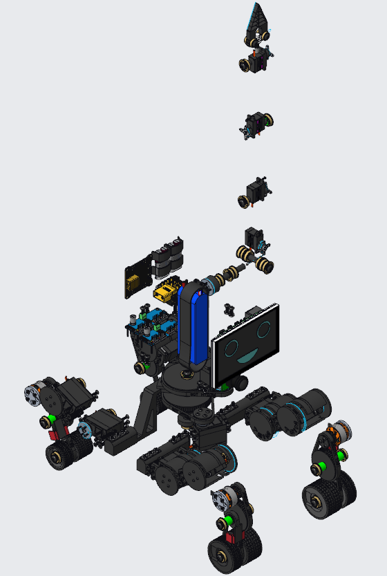
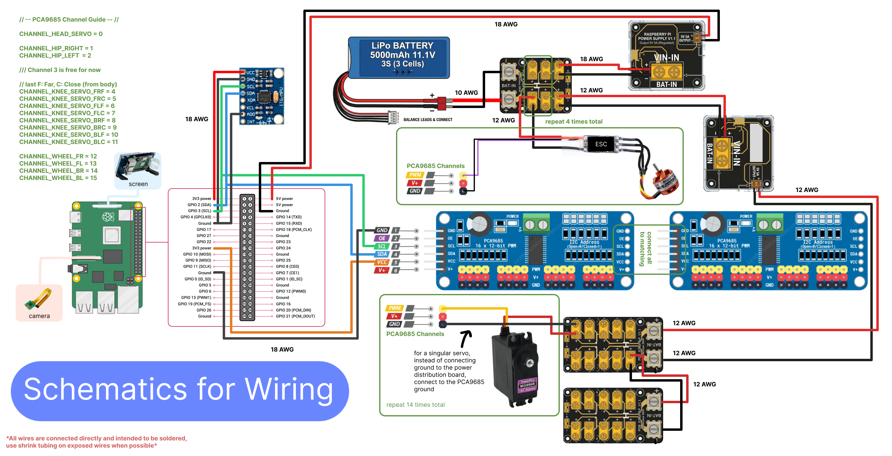

# MIST
MIST is a robot in the form of a rice-cooker with legs, originating from the Pantheon Show. Our goal in this project was to test our skills whilst making something beautiful. 



## Replication
All of the instructions on recreating the robot are provided below.

### Software

#### 1. Operating System
We've chosen DietPi due to its stability and in order to maximise available resources by ditching the GUI. It would be preferarble to flash some ssd instead of a flash card for reliability. In installation of the DietPi on the raspberry pi, we must choose to install these programs: tailscale, openssh, go.

#### 2. Remote control with Tailscale (optional but recommended)
```bash
# Authentication
tailscale up

# Port Forwarding
echo 'net.ipv4.ip_forward = 1' | sudo tee -a /etc/sysctl.conf 
echo 'net.ipv6.conf.all.forwarding = 1' | sudo tee -a /etc/sysctl.conf
sudo sysctl -p

# Once you've connected your pi to the network, you can ssh into it from your personal computer with these commands:
ssh username@tailscale-ip
# You can also use device name given or chosen in tailscale:
ssh username@device-name
```

#### 3. Adding GOPATH to $PATH
```bash
# 
nano ~/.bashrc

# Write these into the file:
export GOPATH=$HOME/go
export PATH="$PATH:$GOPATH/bin"
# Exit nano, and save the changes.

# Apply changes
source ~/.bashrc
```

#### 4. Installing text to voice (espeak)
```bash
# Configure audio drivers:
dietpi-config
# > Select '2: Audio Options'
# > For the 'Sound card', select 'rpi-bcm2835-hdmi' or 'usb-dac' depending on your speaker.

# Install text to speech module:
apt update
sudo apt install espeak-ng -y
```

#### 6. Setting up ollama (embeddinggemma)
```bash
# Install Ollama
sudo apt-get install zstd
curl -fsSL https://ollama.com/install.sh | sh

# Get the model
ollama pull embeddinggemma
```

#### 7. Setting up mist-os
Note that mist-os isn't an actual operating system, but rather just a program.
```bash
# Install mist-os:
go install https://github.com/flushloll/MIST/mist-os/main.go

# Run mist-os:
mist-os

# Stop:
Ctrl + C
```

Optional: If you wish to start mist-os after boot automatically:
```bash
# Find where mist-os is installed:
which mist-os
# > Please remember the path or save it to clipboard

# Open Configuration menu:
dietpi-autostart
# > Select "Custom script (background, no autologin)"
# > Press OK
# DietPi should automatically open an editable text file, otherwise open it:
nano /var/lib/dietpi/dietpi-autostart/custom.sh
# > Paste this into the file:
/root/go/bin/mist-os # paste the path given from `which matetra-client` command.
exit 0
# > Save everything, and exit
```

### Hardware

I would suggest assembling the robot by virtue of the subassemblies in the CAD, starting with the smallest and working up to the largest.

An order like this is good:
1. Chunky-Leg
2. Chunky-Leg-2
3. Skinny-Leg
4. Skinny-Leg-2
5. Rice-Cooker-Lower
6. Rice-Cooker-Center
7. Rice-Cooker-Lid
8. Arm

Keep in mind that if a part is not on the BOM then it is a 3D printed part.
Every 3D printed part is printed in PLA except the nylon_heat_brick part which is printed in nylon filament as well as the small_sleeve_1, small_sleeve_2, big_sleeve_1, and big_sleeve_2 parts which are printed in SEBS filament.

Remember to assemble the electronics and hardware as you go through this order. Everything you need to know to assemble MIST succesfully is on the CAD model.




#### 1. BOM - Bill of Materials

here BOM in CSV

#### 2. Electronics Wiring Guide

Here are the schematics for wiring MIST. When actually wiring MIST physically, consider where you place your wires and ensure no wires will be pinched or sliced. Use mounting tape to secure your wires onto MIST's chassis and use electrical tape and shrink tubing to cover exposed wires.

If you have questions on how to perform certain electrical tasks such as soldering, crimping, using shrink tube & electrical tape, cutting wire, and just splicing wire in general then please research how to do so before working on MIST. MIST can produce currents capable of setting fire or frying electronics. If you are unsure of how to manage these currents through programming then it would be a good idea to integrate physical fuses in between electronics to prevent accidents. When deciding on where fuses can be integrated in your circuit consider the maximum current passing through a segment and use that number to decide on the current limit of your fuse. [Here's a good starting point on how to get started with fuses:](https://community.element14.com/technologies/experts/w/documents/27978/a-comprehensive-guide-to-fuses)



#### 4. Enable I2C & Components Test
```zsh
# Open the configuration menu:
dietpi-config
# > Navigate to 'Advanced Options',
# > Ensure 'I2C state' is selected as 'On',
# > Ensure 'I2C frequency' is set to 100 kHz,
# > Exit and reboot the raspberry pi.

# To see if your IMU module is connected, run:
sudo i2cdetect -y 1
# 0x4b is IMU
# ____ is PCA9685
```

5. Math

## Contribute
### Realtime file sync between devices
In order to sync files between devices in real-time:
```bash
rsync -avz /path/to/local/dir/ username@remote_ip:/path/to/remote/dir/
```
### Fancy-<character> eye
If there is extra time to spend, creating a custom font for fancy-<character> eye type for the screen module would be worth it.

### Questionable arm design?
The servo controlling lateral movement of the arm should be reinforced in future iterations, with both a more powerful servo and thicker bungee cord. With ultra-lightweight printing the current version works hypothetically but it's questionable.

### Joint improvements
Additional revisions of the joints could likely be made using DC motors with encoders rather than servos to use space more efficiently and result in a more accurate replica of MIST from Pantheon.

### Budget Improvements
MIST could be made cheaper overall by reducing the amount of motors/materials used overall. This solution is over-engineered to an extent.

